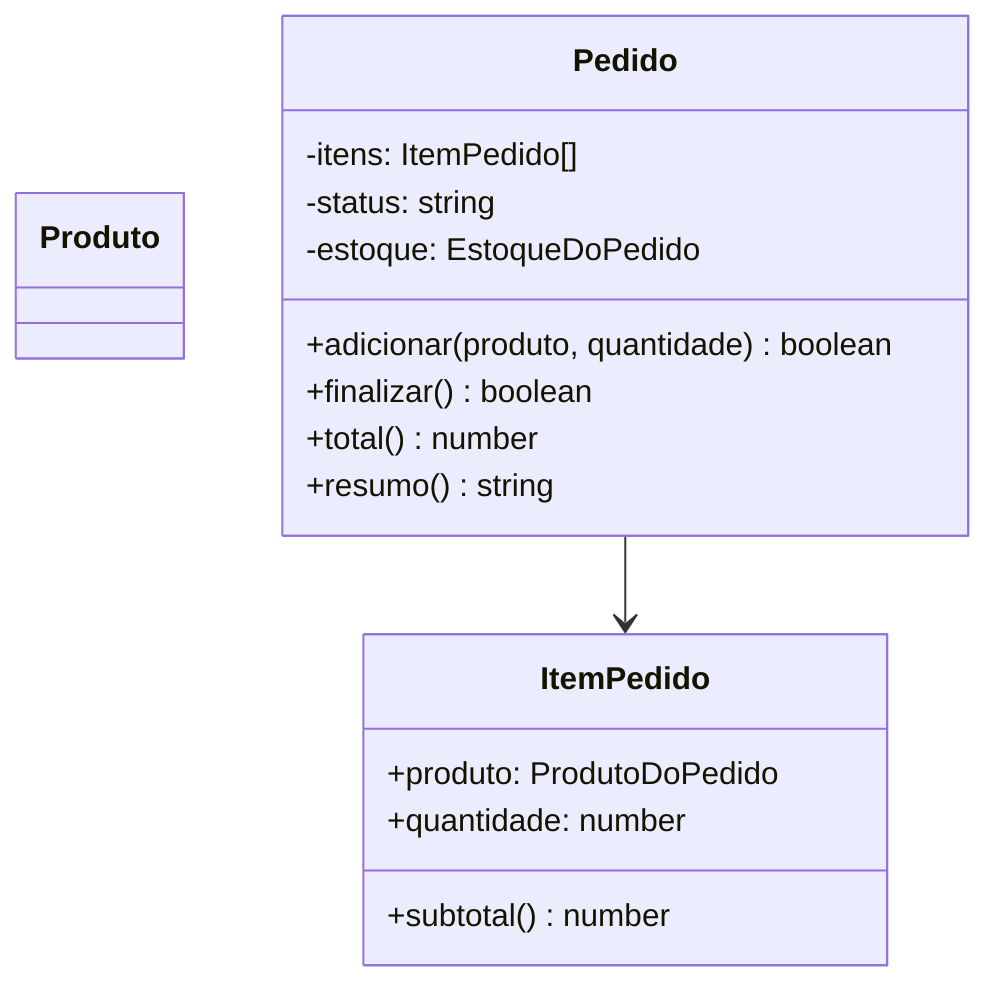

# Modelo do produto

O mapa das classes do backend. Cada dono acrescenta a sua peça no PR em que ela vira classe. O GitHub desenha o diagrama sozinho.

```mermaid
classDiagram
  class Produto {
  }

  class ItemPedido {
    +produto: ProdutoDoPedido
    +quantidade: number
    +subtotal() number
  }

  class Pedido {
    -itens: ItemPedido[]
    -status: string
    -estoque: EstoqueDoPedido
    +adicionar(produto, quantidade) boolean
    +finalizar() boolean
    +total() number
    +resumo() string
  }

  Pedido --> ItemPedido
```
